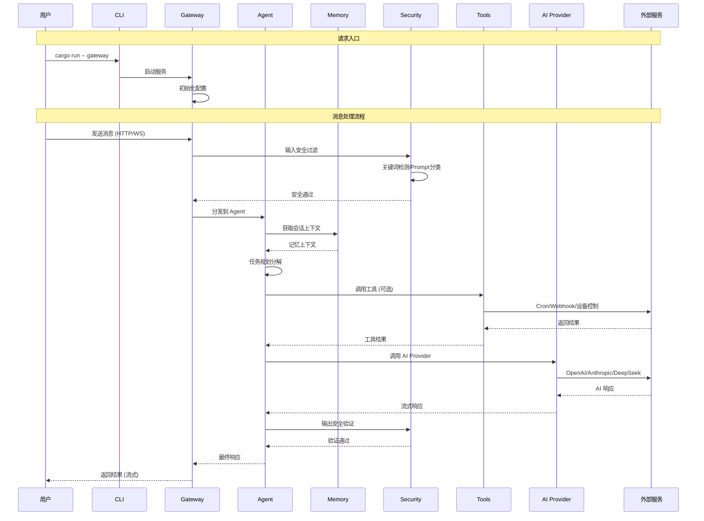

# OpenClaw Rust

🤖 **OpenClaw Rust** - 你的个人 AI 助手 (Rust 实现)

一个功能丰富、模块化的 AI 助手平台，采用现代 Rust 技术栈构建，支持多智能体协作、语音交互、实时协作画布、浏览器自动化控制等功能。

## ✨ 核心特性

| 特性 | 描述 |
|------|------|
| 🤖 **多智能体系统** | Orchestrator、Researcher、Coder、Writer 等多种 Agent 类型，支持任务自动分解与多 Agent 协作 |
| 🧠 **三层记忆架构** | 工作记忆(最近消息) → 短期记忆(压缩摘要) → 长期记忆(向量存储)，支持 per-session 隔离 |
| 🗣️ **语音交互** | STT 语音识别 + TTS 语音合成，支持实时对话与语音唤醒 |
| 🎨 **实时协作画布** | A2UI 可视化工作空间，WebSocket 实时协作，光标同步 |
| 🌐 **多平台消息** | 15+ 消息通道集成 (Telegram、Discord、钉钉、企业微信、飞书等) |
| 🔐 **安全沙箱** | Docker/WASM 双轨隔离，输入过滤/输出验证/审计日志/自我修复 |
| 🛠️ **工具生态** | 浏览器控制、定时任务、Cron 调度、Webhook、设备节点、MCP 集成 |

## 🏗️ 架构设计

### 设计理念

- **模块化**: 每个 crate 独立负责单一职责，通过 trait 定义抽象接口
- **可扩展**: Provider 模式支持灵活扩展 AI 提供商、消息通道、工具类型
- **安全性**: 多层安全防护，敏感操作沙箱隔离，完整审计日志
- **高性能**: 异步 Rust (tokio)，流式响应，连接池

### 系统架构图



### 核心模块

```
openclaw-rust/
├── crates/
│   ├── openclaw-core      # 核心类型定义、配置结构、错误类型
│   ├── openclaw-ai        # AI Provider 抽象层 (OpenAI/Anthropic/DeepSeek...)
│   ├── openclaw-memory    # 三层记忆系统 (工作/短期/长期)
│   ├── openclaw-vector    # 向量存储抽象 (Qdrant/Milvus/Chroma...)
│   ├── openclaw-channels  # 消息通道集成框架
│   ├── openclaw-agent     # 多智能体系统 + Provider 抽象
│   ├── openclaw-voice     # STT/TTS 语音服务
│   ├── openclaw-server    # HTTP/WebSocket Gateway 服务
│   ├── openclaw-canvas    # 实时协作画布
│   ├── openclaw-browser   # 浏览器自动化 (chromiumoxide)
│   ├── openclaw-sandbox   # Docker/WASM 安全沙箱
│   ├── openclaw-tools     # 工具系统 (Cron/Webhook/技能/MCP)
│   ├── openclaw-device   # 设备节点 + 嵌入式设备控制
│   ├── openclaw-security # 安全管线 (过滤/验证/审计)
│   ├── openclaw-cli       # CLI 命令行工具
│   └── openclaw-testing  # 测试工具与 fixtures
```

## 🧠 AI 能力

### 支持的 AI 提供商

- **国际**: OpenAI, Anthropic (Claude), Google (Gemini), DeepSeek
- **国内**: 通义千问 (Qwen), 智谱 GLM, Moonshot (Kimi), 豆包 (Doubao), MiniMax
- **本地**: Ollama (本地大模型)
- **自定义**: OpenAI 兼容 API

### 核心能力

- 流式响应 (Streaming)
- 函数调用 (Function Calling)
- 文本嵌入 (Embedding)
- OAuth 认证支持

## 📡 消息通道

### 国际平台

Telegram | Discord | Slack | Microsoft Teams | WhatsApp | Signal

### 国内平台

钉钉 | 企业微信 | 飞书 | Zalo (越南)

### macOS

iMessage (Apple 消息服务) | BlueBubbles (iMessage REST API)

### 其他

Matrix (去中心化) | WebChat (自定义 Webhook) | Email | SMS

## 🛠️ 工具生态

### 自动化

- **浏览器控制**: Puppeteer 风格 API，导航/点击/输入/截图/PDF
- **定时任务**: Cron 表达式调度，自动执行
- **Webhook**: 事件触发，签名验证

### 设备控制

- **相机/屏幕**: 拍照、录像、屏幕录制
- **嵌入式设备**:
  - ARM: Raspberry Pi, OrangePi, Jetson, Coral
  - Arduino: Uno, Nano, Mega, Due
  - ESP32: ESP32-S3, ESP32-C6, ESP32-P4
  - STM32: STM32F1, STM32F4, STM32H7

### 扩展集成

- **MCP**: Model Context Protocol 客户端 (Stdio/HTTP/SSE)
- **技能系统**: ClawHub/内置/托管/工作区技能

## 🚀 快速开始

### 构建与运行

```bash
# 克隆项目
git clone https://github.com/openclaw/openclaw-rust.git
cd openclaw-rust

# 构建项目
cargo build --release

# 交互式配置向导
cargo run -- wizard

# 启动 Gateway 服务
cargo run -- gateway

# 系统健康检查
cargo run -- doctor
```

### CLI 命令

| 命令 | 功能 |
|------|------|
| `wizard` | 交互式设置向导 |
| `doctor` | 系统健康检查与修复 |
| `gateway` | 启动 HTTP/WebSocket 服务 |
| `daemon start` | 启动后台守护进程 |
| `daemon install` | 安装为系统服务 |

## � API 端点

### 基础 API

| 端点 | 方法 | 功能 |
|------|------|------|
| `/health` | GET | 健康检查 |
| `/chat` | POST | 聊天对话 |
| `/models` | GET | 可用模型列表 |
| `/stats` | GET | 统计信息 |

### 画布 API

| 端点 | 方法 | 功能 |
|------|------|------|
| `/canvas` | POST/GET | 创建/列出画布 |
| `/canvas/{id}` | GET/DELETE | 获取/删除画布 |
| `/canvas/{id}/ws` | GET | WebSocket 协作 |

### 浏览器 API

| 端点 | 方法 | 功能 |
|------|------|------|
| `/browser` | POST | 创建浏览器实例 |
| `/page/{id}/goto` | POST | 导航 |
| `/page/{id}/click` | POST | 点击 |
| `/page/{id}/screenshot` | POST | 截图 |

## ⚙️ 配置

### 配置文件

```json
{
  "user_name": "User",
  "default_provider": "openai",
  "default_model": "gpt-4o",
  "api_keys": {
    "OPENAI_API_KEY": "sk-..."
  },
  "server": {
    "host": "0.0.0.0",
    "port": 18789
  }
}
```

### 环境变量

```bash
export OPENAI_API_KEY="sk-..."
export ANTHROPIC_API_KEY="sk-ant-..."
export OPENCLAW_PORT=18789
```

## 🔧 开发

### 运行测试

```bash
cargo test
```

### 代码检查

```bash
cargo clippy
cargo fmt --check
```

### 文档生成

```bash
cargo doc --open
```

## 📋 系统要求

- **Rust**: 1.93+
- **Docker**: 可选 (沙箱功能)
- **Chrome/Chromium**: 可选 (浏览器控制)

## 🤝 贡献

欢迎贡献！请查看 [贡献指南](CONTRIBUTING.md)。

## 📄 许可证

MIT License - 详见 [LICENSE](LICENSE) 文件。

## 🙏 致谢

- [async-openai](https://github.com/64bit/async-openai) - OpenAI API 客户端
- [chromiumoxide](https://github.com/mattsse/chromiumoxide) - Chrome DevTools Protocol 客户端
- [bollard](https://github.com/fussybeaver/bollard) - Docker API 客户端
- [axum](https://github.com/tokio-rs/axum) - Web 框架

---

**OpenClaw Rust** - 让 AI 助手更简单、更强大
